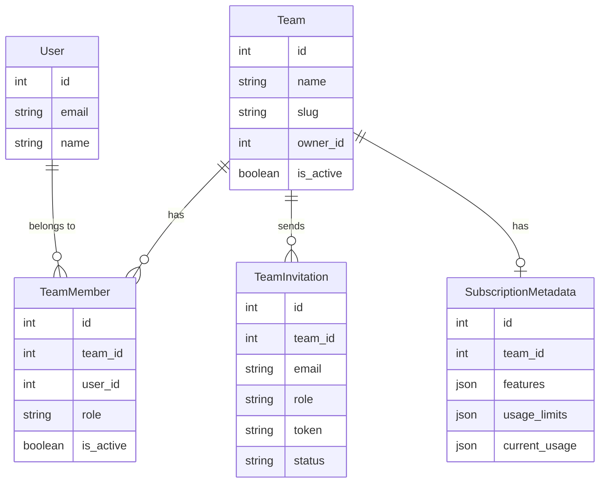
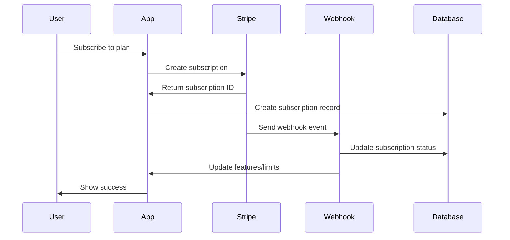

# 💼 SaaS Features Overview

Django Project Template includes a complete, production-ready SaaS stack when you select `project_type: saas` or manually enable SaaS features.

## What's Included

### 🏢 Teams & Organizations
Full multi-tenancy with role-based access control (RBAC).

- **Roles**: Owner, Admin, Member
- **Team Invitations**: Email-based with secure tokens
- **Per-Seat Billing**: Automatic Stripe quantity updates
- **Audit Logging**: Track all team actions

[Learn more →](teams.md)

### 💳 Stripe Integration
Production-ready subscription billing with two modes.

**Basic Mode** (stripe API):
- Simple subscription flows
- Webhook handlers
- Customer portal

**Advanced Mode** (dj-stripe):
- Full subscription management
- Per-seat and usage-based billing
- Subscription metadata
- Comprehensive webhook coverage
- Customer portal integration

[Learn more →](stripe.md)

### 🔒 Feature Gating
Control access to features based on subscription plans.

- `@subscription_required` - Require active subscription
- `@feature_required` - Check for specific features
- `@plan_required` - Enforce plan tiers
- Usage limit checking
- Class-based view mixins

[Learn more →](feature-gating.md)

### 👤 User Impersonation
Staff can impersonate users for debugging and support.

- Secure impersonation flow
- Full audit logging
- Middleware integration
- View helpers
- Security checks

[Learn more →](impersonation.md)

### 🚩 Feature Flags
A/B testing and gradual feature rollouts with django-waffle.

- **Flags**: Boolean on/off per user
- **Switches**: Global on/off
- **Samples**: Percentage-based rollouts
- User/group targeting
- Template tags and decorators

[Learn more →](feature-flags.md)

## Quick Start

### 1. Generate SaaS Project

```bash
copier copy gh:NodirUstoz/Django-project-template my-saas
```

Select `saas` as project type:

```
What type of project are you building?
> saas
```

### 2. Run Migrations

```bash
cd my-saas
uv sync
docker compose up -d
just migrate
```

This creates all SaaS tables:
- `teams_team`
- `teams_teammember`
- `teams_teaminvitation`
- `djstripe_*` (if advanced mode)
- `waffle_*` (feature flags)

### 3. Create Superuser

```bash
just createsuperuser
```

### 4. Configure Stripe

Add to `.env`:

```bash
# Stripe Keys (get from https://dashboard.stripe.com/test/apikeys)
STRIPE_PUBLIC_KEY=pk_test_...
STRIPE_SECRET_KEY=sk_test_...
STRIPE_WEBHOOK_SECRET=whsec_...

# Stripe Configuration
STRIPE_LIVE_MODE=False
```

### 5. Set Up Webhooks

Start server:

```bash
just dev
```

Use Stripe CLI to forward webhooks:

```bash
stripe listen --forward-to localhost:8000/billing/webhooks/stripe/
```

### 6. Create Products & Prices

In Stripe Dashboard or via Django admin:

```python
# Admin: Billing > Plan Configurations
# Create plans with features and limits
```

## Architecture

### Database Schema



### Request Flow

1. **User requests feature**
2. **Middleware** checks team membership
3. **Decorator** checks subscription status
4. **Feature gating** validates access
5. **View** processes request
6. **Response** returned

### Event Flow



## Configuration

### Enable SaaS Features

In `copier.yml` answers or during generation:

```yaml
# Core SaaS
project_type: saas
use_teams: true
use_stripe: true
stripe_mode: advanced

# Optional
use_2fa: true              # Two-factor auth
observability_level: full  # Full monitoring
security_profile: strict   # Enhanced security
```

### Settings

Django Project Template automatically configures:

**Installed Apps**:
```python
INSTALLED_APPS = [
    'apps.teams',
    'apps.billing',
    'djstripe',  # if advanced mode
    'waffle',
]
```

**Middleware**:
```python
MIDDLEWARE = [
    'apps.users.middleware.ImpersonationMiddleware',
    'waffle.middleware.WaffleMiddleware',
]
```

**URLs**:
```python
urlpatterns = [
    path('teams/', include('apps.teams.urls')),
    path('billing/', include('apps.billing.urls')),
]
```

## Real-World Example

### Startup SaaS Platform

```yaml
# copier.yml answers
project_type: saas
project_name: AcmeAnalytics
use_teams: true
use_stripe: true
stripe_mode: advanced
use_2fa: true
api_style: both  # DRF + GraphQL
frontend: nextjs
background_tasks: celery
use_channels: true  # Real-time dashboards
observability_level: full
deployment_targets: kubernetes
```

**What you get:**
- Multi-tenant analytics platform
- Teams with Owner/Admin/Member roles
- Stripe subscriptions (Starter/Pro/Enterprise)
- Feature gating (API access, advanced analytics)
- User impersonation for support
- A/B testing with feature flags
- Real-time WebSocket updates
- Full observability stack
- Production-ready Kubernetes deployment

### Usage in Code

**Protect a view:**

```python
from apps.billing.decorators import subscription_required, feature_required
from apps.teams.permissions import TeamMemberRequiredMixin

@subscription_required
@feature_required('advanced_analytics')
def advanced_report(request):
    # Only users with active subscription
    # AND 'advanced_analytics' feature can access
    return render(request, 'reports/advanced.html')
```

**Check team membership:**

```python
from django.views.generic import ListView
from apps.teams.permissions import TeamMemberRequiredMixin

class ProjectListView(TeamMemberRequiredMixin, ListView):
    # Only team members can access
    model = Project

    def get_queryset(self):
        # Automatically filtered to user's team
        return super().get_queryset().filter(
            team=self.request.user.current_team
        )
```

**Feature flags:**

```python
from apps.core.feature_flags import is_feature_enabled

if is_feature_enabled('new_dashboard', user=request.user):
    return render(request, 'dashboard_v2.html')
else:
    return render(request, 'dashboard.html')
```

## Testing

Django Project Template includes comprehensive SaaS tests:

```bash
# Run all SaaS tests
just test apps/teams apps/billing

# Test coverage
pytest --cov=apps.teams --cov=apps.billing

# Integration tests
pytest tests/test_integration.py -v
```

**Test files included:**
- `tests/teams/test_models.py` - Team, member, invitation tests
- `tests/teams/test_views.py` - View and permission tests
- `tests/billing/test_decorators.py` - Feature gating tests
- `tests/users/test_impersonation.py` - Impersonation tests
- `tests/core/test_feature_flags.py` - Feature flag tests
- `tests/test_integration.py` - End-to-end workflows

## Next Steps

- [Teams & Organizations →](teams.md) - Multi-tenancy setup
- [Stripe Integration →](stripe.md) - Subscription billing
- [Feature Gating →](feature-gating.md) - Access control
- [User Impersonation →](impersonation.md) - Support tools
- [Feature Flags →](feature-flags.md) - A/B testing
